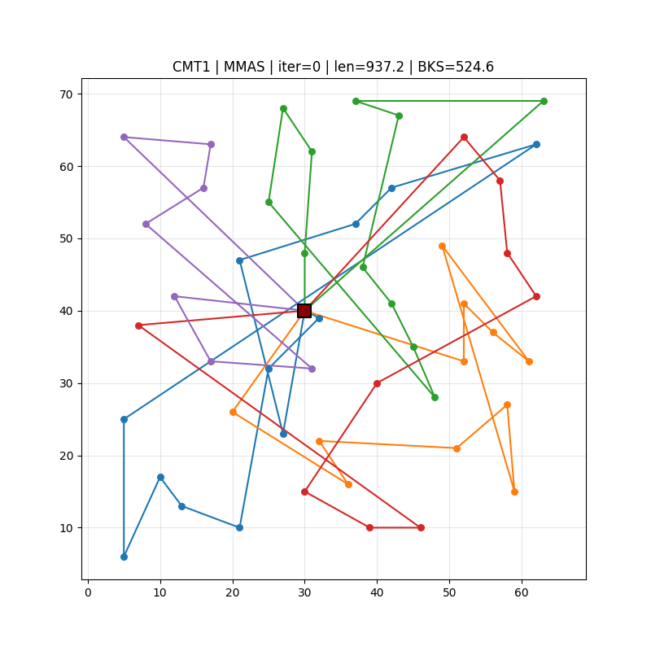

# 🐜 CVRP-ACO — Algorithmic Vehicle Routing with Ant Colony Optimization

Implementacja i porównanie wariantów algorytmu mrówkowego (ACO) dla problemu **Capacitated Vehicle Routing Problem (CVRP)**.

## 📋 Cele projektu

Badanie efektywności czterech podejść do optymalizacji tras pojazdów z ograniczoną pojemnością:

| Algorytm | Opis |
|----------|------|
| **Greedy** | Nearest Neighbor (baseline) |
| **AS** | Ant System (Dorigo, 1992) |
| **MMAS** | MAX-MIN Ant System (Stuetzle & Hoos, 2000) |
| **KMeansACO** | ACO z inicjalizacją feromonów opartą o K-Means |

Eksperyment przeprowadzony na **15 instancjach** z biblioteki CVRPLib (CMT, Golden, Uchoa).

## 📊 Wizualizacja — Przykładowa animacja tras



*Animacja trasowania problemu CMT1 algorytmem MMAS*

---

## 🚀 Szybki start

### Wymagania
- Python 3.13+
- [uv](https://docs.astral.sh/uv/) — `pip install uv` lub `winget install astral-sh.uv`

### Instalacja
```bash
cd projekty/CVRP-ACO
uv sync --all-extras     
```

### Pobranie danych
Dane należy pobrać ręcznie ze strony [CVRPlib](https://galgos.inf.puc-rio.br/cvrplib/en/instances)

```bash
uv run python -m src.build_bks         # buduje bks.json z best-known solutions
```

---

## ⚙️ Eksperymenty

### Główny eksperyment
```bash
uv run python -m experiments.run --config experiments/configs/main.yaml --n-jobs -1
```
Uruchamia: 4 algorytmy × 15 instancji × 5 powtórzeń z równoległym przetwarzaniem.

### Grid search
```bash
uv run python -m experiments.run --config experiments/configs/gridsearch.yaml --n-jobs -1
```

### Analiza i generacja raportów
```bash
uv run python -m experiments.analyze_results results/
```

Wygeneruje:
- Tabele wyników w `results/tables/` (CSV, LaTeX)
- Wykresy w `results/figures/` (PNG)

---

## 📁 Struktura projektu

```
CVRP-ACO/
├── src/                    # Kod źródłowy
│   ├── greedy.py           # Algorytm greedy (baseline)
│   ├── aco_base.py         # Klasa bazowa Ant System
│   ├── aco_mmas.py         # Wariant MMAS
│   ├── aco_KM.py           # Wariant K-Means+ACO
│   ├── utils.py            # Narzędzia (loader, wizualizacja)
│   └── schemas.py          # Typy danych (@dataclass)
│
├── experiments/            # Skrypty eksperymentów
│   ├── run.py              # Runner eksperymentów
│   ├── analyze_results.py  # Analiza i generacja raportów
│   └── configs/            # Konfiguracje YAML
│
├── data/                   # Instancje CVRPLib
│   ├── CMT/                # Zestaw CMT
│   ├── Golden/             # Zestaw Golden
│   └── Uchoa/              # Zestaw Uchoa
│
├── results/                # Wyniki eksperymentów
│   ├── anim_*/             # Animacje tras
│   ├── figures/            # Wykresy
│   ├── tables/             # Tabele wyników
│   ├── stats/              # Wyniki testów statystycznych
│   └── history/            # Historia konwergencji per algorytm
│
├── pyproject.toml          # Zależności i konfiguracja
└── bks.json                # Best-Known Solutions (z plików .sol) 
```

---

## ✅ Kontrola jakości kodu

```bash
# Type checking (strict mode)
uv run mypy src experiments

# Formatowanie i linting
uv run black src experiments
uv run ruff check --fix src experiments
```
